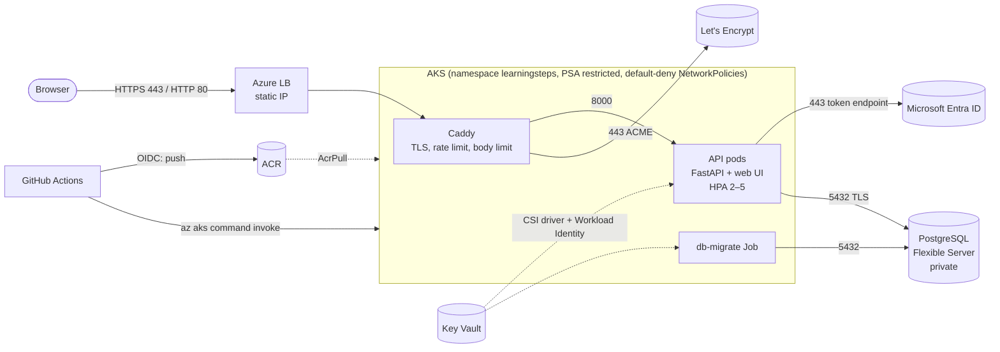

## Repository layout

```
app/                  FastAPI application, Dockerfile, schema, migration script
  api/                API code (routers, repositories, services, auth, Entra ID, error pages)
  frontend/           Web UI: Vite + React + TypeScript + shadcn/ui, built into api/static
caddy/                Custom Caddy build (TLS ingress, rate limiting) and its Dockerfile
infra-terraform/      Terraform: network, AKS, PostgreSQL, ACR, Key Vault, identities, Entra app
  bootstrap/          Remote-state storage (applied once, local state)
k8s-manifests/        Kubernetes manifests (templates) and render.sh
  cluster/            Applied once by an operator: namespace, SecretProviderClasses
  app/                Applied on every deploy: workloads, services, policies
  monitoring/         kube-prometheus-stack values, PodMonitor, install.sh, port-forward.sh, Procfile (operator)
monitoring/           Prometheus config + alert rules, Grafana provisioning + dashboard (local and AKS)
.github/              CI/CD workflow and Dependabot
docker-compose.yml    Local run
```

## Architecture



## Prerequisites

| Tool | Used for |
|---|---|
| Docker Desktop | Local run, image builds |
| Azure CLI (`az login`, role **Owner** on the subscription) | Terraform auth, ACR, AKS credentials |
| Terraform ≥ 1.9 | Infrastructure |
| kubectl + kubelogin | Cluster access via Entra ID (local accounts are disabled) |
| Trivy, hadolint | Image, IaC and manifest scanning |
| Node.js 24 (optional) | Web UI development with hot reload |

---

## Step 1 — Start from the reference branch

The brief uses the `reference` branch of the upstream repo, which has all CRUD endpoints implemented (`main` has TODO stubs for `GET/DELETE /entries/{id}`).

```bash
git clone https://github.com/someson/learningsteps.git && cd learningsteps
git checkout -b reference --track origin/reference   # local copy of the branch
git checkout main
git merge --no-ff reference                          # bring the full implementation into main
```

**Problem:** merge conflict in `api/main.py` — both branches added the same `/` → `/docs` redirect; `reference` additionally logs a startup message.
**Solution:** kept the `reference` version (`git checkout --theirs api/main.py`), since it is a superset.

## Step 2 — Restructure the repository

Moved the application into `app/` to match the layout in the brief, next to `infra-terraform/` and `k8s-manifests/`. `git mv` keeps file history.

```bash
mkdir app
git mv api database_setup.sql start.sh test_api.py .env-sample README.md app/
```

Added to `.gitignore` before any Terraform file was committed — the state would otherwise leak infrastructure details:

```
**/.terraform/*   *.tfstate   *.tfstate.*   *.tfvars   !*.tfvars.example   *.tfplan   backend.hcl
```

## Step 3 — Run locally with Docker Compose

The upstream repo relied on a VS Code dev container. It was replaced by a plain `docker-compose.yml` in the root, so the app runs with Docker alone and uses the **same image** that is deployed to AKS.

```bash
cp app/.env-sample app/.env          # app settings + app-role DSN (git-ignored)
cp app/.env.db-sample app/.env.db    # PostgreSQL admin credentials — the API container never gets these
docker compose up -d --build         # builds app/Dockerfile, runs migrate, starts API + PostgreSQL 16
docker compose ps -a                 # migrate: Exited (0), api/postgres: healthy
```

The one-shot `migrate` service is the same code as the `db-migrate` Job in AKS (Step 8): it creates the unprivileged `learningsteps` role and applies the schema. The API connects only as that role.

Local users (password from stdin, at least 12 characters; password login is enabled locally, disabled in AKS):

```bash
echo 'admin-password-1' | docker compose exec -T api python create_user.py admin --admin
echo 'alice-password-1' | docker compose exec -T api python create_user.py alice
echo 'bob-password-123' | docker compose exec -T api python create_user.py bob
open http://localhost:8000/          # web UI; /docs after sign-in
```

Compose hardening: API published on `127.0.0.1:8000` only (not the LAN); PostgreSQL not published at all; API container `read_only`, `cap_drop: [ALL]`, `no-new-privileges`.

Functional check — the repo's test script exercises every endpoint, authentication, data isolation between users, limits and the admin API:

```bash
python3 -m venv .venv && . .venv/bin/activate
pip install -r app/requirements-dev.txt
python app/test_api.py               # 101 checks (was 6 requests at the start)
```

Web UI development with hot reload: `cd app/frontend && npm ci && npm run dev` → http://localhost:5173 (requests to `/api` are proxied to `:8000`).

**Problem:** port 5432 on the host was already taken by another project's PostgreSQL.
**Solution:** the compose file does not publish PostgreSQL at all; the API reaches it over the compose network by service name.

## Step 4 — Harden the application

Changes made to the upstream code before containerising it:

| Issue found | Fix |
|---|---|
| A new asyncpg connection **pool was created per request** — would exhaust the DB's connection limit under load | One pool per process, opened in FastAPI's `lifespan` |
| `PATCH` accepted a raw `dict` and stored anything the client sent | `EntryUpdate` Pydantic model, `extra="forbid"`, 3–256 chars |
| Partial `PATCH` **wiped** the fields that were not sent (whole JSONB document rewritten) | Merge onto the existing entry before writing (later: one atomic `UPDATE … data \|\| $3`, Step 13) |
| DB exception text returned to the client (`400 Error creating entry: <exception>`) | Log the details, return a generic 500 |
| No health endpoints for Kubernetes | `/healthz` (liveness, no DB) and `/readyz` (readiness, pings DB → 503 when down) |
| Password only via `DATABASE_URL` env var | Also `DATABASE_URL_FILE`, for secrets mounted as files |
| Unpinned deps, three unused (`sqlalchemy`, `psycopg2-binary`, `aiohttp`) | Pinned versions, unused removed |

Verification of readiness behaviour:

```bash
docker stop learningsteps-postgres-1   # /healthz → 200, /readyz → 503
docker start learningsteps-postgres-1  # /readyz → 200 again, pool reconnects by itself
```

## Step 5 — Build a minimal, CVE-free image

`app/Dockerfile` is multi-stage: the web UI is built in a `node:24-alpine` stage (only the static files are copied on), Python dependencies are installed into a venv in a builder stage, and only the venv, the code and the static files go into the runtime image.

```bash
hadolint app/Dockerfile                                             # lint: clean
trivy image --severity HIGH,CRITICAL --exit-code 1 learningsteps-api:local
```

Base images compared (same app, same tests, all passed 6/6):

| Base | Size | HIGH/CRITICAL | Shell |
|---|---|---|---|
| `python:3.12-slim` | 184 MB | 44 (none fixable) | yes |
| `gcr.io/distroless/python3-debian13` | 101 MB | 22 (none fixable) | no |
| `gcr.io/distroless/python3-debian12` | — | 53 (19 fixable) | no |
| `python:3.14-alpine` | 78 MB | 0 | yes |
| **`cgr.dev/chainguard/python`** (chosen) | **105 MB** | **0 of any severity** | **no** |

Chainguard was chosen: zero known CVEs and no shell or package manager for an attacker to use. All base images are pinned by digest (the free tier only publishes `latest`, so the digest is what makes builds reproducible; Dependabot bumps the digests).

Runtime properties: non-root UID `65532`; code owned by root and read-only for the app user; works with a read-only root filesystem; no `--reload`. `ENTRYPOINT` is only the interpreter, so the migration Job runs the same image with `migrate.py`.

**Problem:** after switching bases, Trivy still reported 2 HIGH — `msgpack` and `setuptools`.
**Solution:** they were vendored inside **pip** (`pip/_vendor`), which had been copied into the runtime venv. The app never uses pip at runtime → `pip uninstall -y pip` in the builder stage. Result: 0.

**Problem (carried over from the VM deployment):** asyncpg probes `~/.postgresql/postgresql.key` on every connect; if `HOME` is unreadable the probe raises `EACCES` instead of "not found" and every request returns 500.
**Solution:** `ENV HOME=/home/nonroot` — a directory that exists and is readable in the image.

## Step 6 — Provision Azure with Terraform

### 6.1 Validate and scan before touching Azure

```bash
cd infra-terraform
terraform init -backend=false        # download providers only
terraform validate
trivy config --tf-vars terraform.tfvars.example --severity HIGH,CRITICAL .
```

**Problem:** `validate` failed. The code targeted azurerm **v5**, which renamed arguments (`azurerm_federated_identity_credential` now takes `user_assigned_identity_id`; the DNS zone link takes `private_dns_zone_id`).
**Solution:** checked the provider schema (`terraform providers schema -json`) and updated the arguments.

**Problem:** the root `main.tf` actually contained the **bootstrap** module (state storage), and the real root `main.tf` (resource group, locals) was missing.
**Solution:** moved it to `bootstrap/main.tf` and restored the root file.

**Problem:** Trivy reported 3 CRITICAL + 1 HIGH. Fixes:

| Finding | Fix |
|---|---|
| AKS without RBAC / with local accounts | Entra ID + Azure RBAC for Kubernetes, `local_account_disabled = true` |
| AKS API server open to the internet | `authorized_ip_ranges` = admin IP only |
| Key Vault without network ACL | `default_action = "Deny"`, admin IP + AKS subnet (service endpoint) |
| State storage without network rules | Same pattern in `bootstrap/` |

Result: **0 HIGH/CRITICAL**. Remaining MEDIUM/LOW are documented trade-offs (e.g. Key Vault purge protection is off so `terraform destroy` + `apply` can round-trip, which is a success criterion).

Further security changes, not flagged by the scanner:

- **Passwords never touch state.** `ephemeral "random_password"` + write-only arguments (`administrator_password_wo`, `value_wo`). Verified after apply: `terraform state pull | grep -c postgresql://` → `0`.
- **The app does not connect as the DB admin.** A separate role is created in-database by a migration Job (Step 8); the admin connection string is readable only by the migrator identity (role assignment scoped to the individual Key Vault secret).
- **No federated credential for pull requests.** The CI identity can push images and deploy; a PR branch must not get those rights.
- **NSG rule for 80/443** on the AKS subnet. AKS writes LoadBalancer rules into its own NSG, but traffic also passes the subnet NSG; without the rule the ingress would be unreachable.

### 6.2 Choose a region

```bash
az vm list-skus -l westeurope --size Standard_D2s_v6 --query "[0].restrictions[].reasonCode"
# → NotAvailableForSubscription
```

**Problem:** the subscription has SKU restrictions. In `westeurope` and `germanywestcentral` no common 2-vCPU size was available; `germanynorth` is a restricted region with no VM access at all.
**Solution:** scanned 13 European regions for unrestricted SKUs, the vCPU quota (10), PostgreSQL `B1ms` and AKS availability. `swedencentral` offers all of them → set as `location`.

### 6.3 Bootstrap the remote state

```bash
cp terraform.tfvars.example terraform.tfvars   # github_repository, admin_ip_ranges (your IP /32)
cd bootstrap
terraform init
terraform plan -var-file=../terraform.tfvars -out=bootstrap.tfplan
terraform apply bootstrap.tfplan               # 5 resources: RG, storage account, container, role
terraform output -raw backend_hcl > ../backend.hcl
```

The state storage account has shared keys disabled, blob versioning on, and network access limited to the admin IP.

### 6.4 Apply the main configuration

```bash
cd ..
terraform init -backend-config=backend.hcl     # remote state, Entra ID auth
terraform plan -out=main.tfplan                # 44 to add
terraform apply main.tfplan                    # ~6 min; AKS and PostgreSQL ~5 min each
```

Result: 44 resources — VNET with 2 subnets and NSGs, private DNS, PostgreSQL Flexible Server (no public endpoint), AKS, ACR, Key Vault with 2 secrets, 3 managed identities with federated credentials, static ingress IP. (Later additions: the CI run-command role in Step 11, the Entra app registration in Step 14.)

**Problem:** the first `plan` after apply showed **16 changes** on resources created a minute earlier.
**Cause:** (1) an organisation-level Azure Policy stamps a `created-on` tag on every resource — Terraform wanted to remove it, the policy would add it back, forever; (2) Azure added a `Microsoft.Storage` service endpoint to the DB subnet when creating the Flexible Server.
**Solution:** `lifecycle { ignore_changes = [tags["created-on"]] }` on tagged resources (main and bootstrap), and the service endpoint declared explicitly in `network.tf`. `terraform plan` → `No changes`.

### 6.5 Connect kubectl

Resource names are `<project>-<environment>-…` from `terraform.tfvars` (defaults: `learningsteps-dev-rg`, `learningsteps-dev-aks`, `learningsteps-dev-github-id`, used as examples below). The commands read them from Terraform, so they work with any names:

```bash
RG=$(terraform output -raw resource_group_name)    # run in infra-terraform/
AKS=$(terraform output -raw aks_cluster_name)
az aks get-credentials -g $RG -n $AKS
kubelogin convert-kubeconfig -l azurecli       # kubectl authenticates with Entra ID
kubectl get nodes                              # 2 nodes Ready, Kubernetes 1.35
```

## Step 7 — Build the ingress image (Caddy)

Caddy terminates TLS with a Let's Encrypt certificate for the **bare public IP** (supported since January 2026 under the `shortlived` profile, ~6-day certificates, renewed automatically).

```bash
docker pull caddy:2.11-alpine
trivy image --severity HIGH,CRITICAL caddy:2.11-alpine    # 17 HIGH, all in the Go binary
```

**Problem:** the official image carried 17 fixable HIGH CVEs in Caddy's Go dependencies (`golang.org/x/crypto`, `x/net`, `x/text`, `grpc`, stdlib). Chainguard's Caddy image is not available on the free tier.
**Solution:** build Caddy from source. `caddy/main.go` imports the standard modules plus `caddy-ratelimit` (added in Step 13); `go.mod` pins Caddy v2.11.4 with current dependencies; the binary is copied into `cgr.dev/chainguard/static` (no shell, non-root, CA certificates included for ACME).

```bash
docker buildx build --platform linux/amd64 -t learningsteps-caddy:local caddy
trivy image learningsteps-caddy:local           # 0 HIGH/CRITICAL (7 MEDIUM/LOW)
```

**Problem:** the workstation is Apple Silicon (arm64); AKS nodes are amd64.
**Solution:** images for the cluster are built with `--platform linux/amd64`.

## Step 8 — Kubernetes manifests

Templates with `${VAR}` placeholders; `render.sh` fills them from `terraform output` locally (or from environment variables in CI, which has no access to the state) and writes to `k8s-manifests/rendered/` (git-ignored).

```bash
ACME_EMAIL=<your e-mail> k8s-manifests/render.sh
trivy config --severity HIGH,CRITICAL --exit-code 1 k8s-manifests/rendered    # 7 files, 0 findings
kubectl apply --dry-run=server -f k8s-manifests/rendered/cluster/namespace.yaml
```

| Manifest | Purpose |
|---|---|
| `cluster/namespace.yaml` | Namespace with Pod Security Admission `restricted` |
| `cluster/secretproviderclasses.yaml` | Key Vault secrets → files in pods (no Kubernetes Secrets) |
| `app/serviceaccounts.yaml` | One ServiceAccount per workload, each bound to its own Azure identity |
| `app/migrate-job.yaml` | Creates the app DB role, applies the schema (`app/api/migrate.py`) |
| `app/api.yaml` | ConfigMap (incl. Entra settings), Deployment (probes, limits, read-only FS), ClusterIP Service, HPA 2–5, PDB |
| `app/caddy.yaml` | Caddyfile (TLS, rate limits, body limit, 502–504 pages), PVC for certificates, Deployment, LoadBalancer Service on the static IP |
| `app/networkpolicies.yaml` | Default deny; internet → Caddy → API → DB subnet; Caddy → Let's Encrypt; API → Entra ID (public 443) |

**Problem:** `database_setup.sql` was applied only by the Postgres container's init hook — nothing applies it to a managed server (the same gap as in the VM deployment).
**Solution:** `app/api/migrate.py`, run as a Job from the API image before each rollout. It creates or re-passwords the `learningsteps` role, revokes `PUBLIC` access and applies the schema. Idempotent; the psql-only line `\d entries;` was removed from the schema file.
_Revised in Step 13:_ the first version applied the schema **as the app role**, so the API owned its tables and could `DROP` them. Now the admin role owns every object and the app role gets only the row privileges it needs (no DDL, no `DELETE` on `entries`/`users`).

**Problem:** `trivy config k8s-manifests/.rendered` reported 0 findings — because it scanned **nothing**: Trivy skips hidden directories.
**Solution:** output directory renamed to `rendered/`; verified that a deliberately `privileged: true` pod is caught (3 HIGH/CRITICAL).

## Step 9 — Deploy to AKS (first deploy, by hand)

Since Step 11 every deploy is done by the pipeline; this is the manual path used to bring the cluster up the first time.

### 9.1 Push images to ACR

The tag is the commit SHA; `-dirty` marks a build from uncommitted changes. Images are built for `linux/amd64` (the nodes), not the arm64 workstation.

```bash
ACR=$(terraform -chdir=infra-terraform output -raw acr_login_server)
TAG="$(git rev-parse --short HEAD)$(git diff-index --quiet HEAD -- || echo -dirty)"
az acr login -n ${ACR%%.*}                     # Entra ID token, no admin user
docker buildx build --platform linux/amd64 -t $ACR/learningsteps-api:$TAG   --push app
docker buildx build --platform linux/amd64 -t $ACR/learningsteps-caddy:$TAG --push caddy
```

AKS pulls from ACR with its kubelet identity (`AcrPull`), so no `imagePullSecret` exists anywhere.

### 9.2 Cluster-scoped objects (operator, once)

```bash
ACME_EMAIL=<your e-mail> k8s-manifests/render.sh
kubectl apply -f k8s-manifests/rendered/cluster/   # namespace (PSA restricted) + 2 SecretProviderClasses
```

### 9.3 Database migration

Network policies go first: with `default-deny-all` in place, the Job could not reach the database otherwise.

```bash
cd k8s-manifests/rendered/app
kubectl apply -f serviceaccounts.yaml -f networkpolicies.yaml -f migrate-job.yaml
kubectl wait -n learningsteps --for=condition=complete job/db-migrate-$TAG --timeout=240s
kubectl logs -n learningsteps job/db-migrate-$TAG
#   Created role learningsteps
#   Granted learningsteps access to database learning_journal
#   Schema applied from /app/database_setup.sql
```

Succeeding on the first run proves the whole chain at once: Workload Identity token exchange → Key Vault via the CSI driver → NetworkPolicy egress to the DB subnet → TLS connection to the private Flexible Server.

### 9.4 API and ingress

```bash
kubectl apply -f api.yaml -f caddy.yaml
kubectl rollout status -n learningsteps deploy/learningsteps-api
kubectl rollout status -n learningsteps deploy/caddy
kubectl get svc caddy -n learningsteps          # EXTERNAL-IP = the static IP from Terraform
INGRESS_IP=$(kubectl get svc caddy -n learningsteps -o jsonpath='{.status.loadBalancer.ingress[0].ip}')
kubectl logs -n learningsteps deploy/caddy | grep -i certificate
```

**Problem:** Caddy could not obtain the certificate — `Timeout during connect (likely firewall problem)` from Let's Encrypt on port 80.
**Cause:** the NSG rule on the AKS subnet allowed 80/443 with destination `10.20.0.0/22` (the subnet). The AKS load balancer uses **floating IP**: packets reach the nodes with the *public* frontend address as destination, so the rule never matched and traffic fell through to `DenyAllInbound`. Found by comparing with the rule AKS writes into its own NSG:

```bash
NRG=$(az aks show -g $RG -n $AKS --query nodeResourceGroup -o tsv)
az network nsg list -g $NRG --query "[].securityRules[?direction=='Inbound'].{dst:destinationAddressPrefix,ports:destinationPortRanges}[]"
# → dst <INGRESS_IP>, ports 80,443
```

**Solution:** `destination_address_prefix = azurerm_public_ip.ingress.ip_address` in `network.tf`, `terraform apply` (1 rule changed). Caddy's next retry obtained the certificate within 15 seconds.

### 9.5 Verify

At the time of the first deploy (before authentication existed):

```bash
curl -sS https://$INGRESS_IP/docs -o /dev/null -w '%{http_code}\n'   # 200 — no -k: publicly trusted
curl -sSI http://$INGRESS_IP/docs | head -1                          # 308 → https
curl -sS -o /dev/null -w '%{http_code}\n' https://$INGRESS_IP/healthz # 404 — probes are internal only
kubectl get hpa,deploy -n learningsteps                               # 2/2 API replicas, one per node
terraform -chdir=infra-terraform plan                                 # No changes
```

Results:

- TLS 1.3, certificate issued by Let's Encrypt for `IP Address: <INGRESS_IP>`, valid 7 days, renewed by Caddy
- `Strict-Transport-Security` sent, `Server` header removed
- `app/test_api.py` against `https://$INGRESS_IP`: 6/6
- HPA at 2 replicas (min), spread across both nodes

Today `/` serves the web UI and `/docs` answers 401 without a session (Step 13); the pipeline's smoke test checks exactly that (Step 11).

## Step 10 — GitHub repository settings

Done with the GitHub CLI (`gh auth status` → account with `repo` and `workflow` scopes). Repo: public fork `someson/learningsteps`.

```bash
R=someson/learningsteps
gh api repos/$R --jq .security_and_analysis        # secret scanning + push protection: already enabled

# CI configuration as repository VARIABLES — identifiers, not credentials
terraform -chdir=infra-terraform output -json github_repository_variables \
  | python3 -c 'import json,sys;[print(k,v) for k,v in json.load(sys.stdin).items()]' \
  | while read k v; do gh variable set "$k" -R $R --body "$v"; done
# + WORKLOAD_CLIENT_ID, MIGRATOR_CLIENT_ID, TENANT_ID, KEY_VAULT_NAME, INGRESS_IP,
#   INGRESS_PIP_NAME, INGRESS_RG, DB_SUBNET_CIDR, ACME_EMAIL (read by render.sh in CI)
#   and later ENTRA_CLIENT_ID, ENTRA_TENANT, ENTRA_ALLOWED_TENANTS (Step 14)

gh api -X PUT repos/$R/vulnerability-alerts          # Dependabot alerts
gh api -X PUT repos/$R/automated-security-fixes      # Dependabot security PRs

# Deployment environment, restricted to main
echo '{"deployment_branch_policy":{"protected_branches":false,"custom_branch_policies":true}}' \
  | gh api -X PUT repos/$R/environments/production --input -
gh api -X POST repos/$R/environments/production/deployment-branch-policies -f name=main -f type=branch
```

No repository **secrets** exist: Azure login uses OIDC. Branch protection on `main`: the CI checks are required, branch must be up to date, no force push or deletion.

**Problem:** the Azure federated credential trusted the subject `repo:someson/learningsteps:ref:refs/heads/main`. A deploy job that declares `environment: production` receives a token with the subject `...:environment:production` instead, so Azure login would fail. Simply adding a second credential would leave a bypass: a job on `main` without the environment would still get Azure access, skipping the environment's rules.
**Solution:** replaced the branch credential with one for the environment (`infra-terraform/identity.tf`; `terraform apply`: 1 added, 1 destroyed), and restricted the environment to `main` on GitHub **before** applying — so the new credential was never usable from another branch. The environment is now the single gate in front of Azure.

```bash
az identity federated-credential list -g $RG --identity-name learningsteps-dev-github-id --query "[].subject" -o tsv
# repo:someson/learningsteps:environment:production
```

**Problem:** the subject GitHub puts into the OIDC token no longer matched the credential, so Azure login could not succeed.
**Cause:** GitHub issues OIDC tokens whose subject uses the **immutable** owner and repository IDs, not only the names.
**Solution:** `github_owner_id` / `github_repository_id` variables in Terraform, and the credential's subject built from them (`identity.tf`, commit `611ed8b`). This also means a renamed or re-created repository with the same name cannot inherit Azure access.

## Step 11 — CI/CD pipeline (GitHub Actions)

`.github/workflows/ci-cd.yml` runs on every push and every PR to `main`. Four check jobs have **no Azure access** at all; only `deploy` can request an OIDC token, and only on `main` through the `production` environment.

| Job | What it does | Fails on |
|---|---|---|
| `build-test` | `ruff check`, `docker compose up` (same image + migrate + Postgres), creates throwaway users with random passwords, runs `app/test_api.py` (101 checks) | lint error, any failed check |
| `scan-image (api)`, `scan-image (caddy)` | builds each image, saves it as a tarball, **Trivy** scans the tarball | any HIGH/CRITICAL |
| `scan-iac` | **Trivy** on Terraform, **Trivy** on the web UI's npm dependencies, **hadolint** on both Dockerfiles, renders manifests with dummy values and runs **Trivy** on them | any HIGH/CRITICAL, Dockerfile lint |
| `secrets` | **Gitleaks** over the full git history | any finding |
| `deploy` (main only) | pushes images to ACR, runs the migration Job, rolls out API and Caddy, smoke test | any step |

Design choices:

- **The scanned image is the deployed image.** `scan-image` uploads the exact tarball it scanned; `deploy` loads and pushes that one, no rebuild in between.
- **Tags.** API: commit SHA. Caddy: the git tree hash of `caddy/`, so the tag changes only when Caddy's source does; an unchanged tag leaves the single Caddy pod (Recreate strategy) alone. Existing tags are never overwritten.
- **Everything pinned.** Actions by commit SHA, tool images (Trivy, hadolint, Gitleaks) by digest. Dependabot bumps actions, pip, npm, Docker digests, compose and Go modules weekly.
- **Least privilege.** `permissions: contents: read` globally, `id-token: write` only in `deploy`. `concurrency` never cancels a run on `main` mid-deploy.

**Problem:** the AKS API server accepts only `admin_ip_ranges`; GitHub-hosted runners have no fixed IP, so `kubectl` from the runner cannot reach the cluster.
**Solution:** deploy through **`az aks command invoke`** — Azure runs `kubectl` in a pod inside the cluster via ARM, authenticated with the pipeline's Entra token, so the namespace-scoped `Azure Kubernetes Service RBAC Writer` assignment still limits what it can change. The only built-in role with `runCommand` is Cluster Admin (which also hands out admin credentials), so Terraform defines a **custom two-action role** (`runCommand/action`, `commandResults/read`).

**Problem:** `az aks command invoke` exits 0 even when the remote command fails — a broken migration looked green.
**Solution:** `-o json`, print `.logs`, and `exit "$(jq -r .exitCode <<<"$out")"`.

**Problem:** `docker compose up --wait` did not cope reliably with the one-shot `migrate` container in CI.
**Solution:** poll `/readyz` with `curl --retry` instead.

Smoke test after deploy (no `-k`: the certificate must be valid):

```
/              200   web UI
/api/entries   401   bogus session cookie: path Caddy → API → DB works, and auth is enforced
/docs          401   Swagger only for signed-in users
/no-such-page  404   error page, not 5xx
```

### 11.1 Watching a deploy in the Azure portal

The pipeline's steps are visible only in GitHub → Actions; what they do in Azure can be followed in the portal:

| Where | What you see |
|---|---|
| AKS → **Activity log** | Two *Run command* operations per deploy (migration, rollout) by `learningsteps-dev-github-id` |
| AKS → **Kubernetes resources → Workloads**, namespace `learningsteps` | Job `db-migrate-<sha>`; the Deployment's new ReplicaSet replacing pods one at a time; the image tag in the pod YAML. Namespace `aks-command`: the temporary `command-…` pod running kubectl |
| AKS → Kubernetes resources → **Events** | Pulling, Started, Killing, probe failures |
| Container registry → **Repositories** | A new `learningsteps-api:<sha>` per deploy; `learningsteps-caddy` only when `caddy/` changed |
| AKS → Monitoring → **Insights** | Restarts, CPU and memory per container, replica counts (Container Insights, `oms_agent` in `aks.tf`) |
| AKS → Monitoring → **Logs** | KQL over `KubeEvents` and `ContainerLogV2` (see below) |

The Kubernetes resources views connect from the browser to the API server, so they work only from an IP in `admin_ip_ranges`.

```kusto
KubeEvents
| where TimeGenerated > ago(1h) and Namespace == "learningsteps"
| project TimeGenerated, ObjectKind, Name, Reason, Message
| order by TimeGenerated desc

ContainerLogV2
| where TimeGenerated > ago(1h) and PodNamespace == "learningsteps"
| where PodName startswith "db-migrate" or PodName startswith "learningsteps-api"
| project TimeGenerated, PodName, LogMessage
| order by TimeGenerated desc
```

## Step 12 — Web UI

The upstream app had only Swagger. A web UI now lives at `/`; the JSON API moved under `/api` (PR #7).

- **Stack:** Vite, React 19, TypeScript, Tailwind v4, shadcn/ui (neutral palette), lucide-react, sonner. Sources in `app/frontend/`; the build goes to `app/api/static/` and FastAPI serves it. In the image it is built in a separate `node:24-alpine` stage — Node never reaches the runtime image.
- **Entries table:** server-side pagination (10/20/50/100), debounced search, sorting by any column.
- **Entries:** view in a dialog with previous/next (also across page boundaries); create and edit (only changed fields are sent); delete with **Undo**; delete all own entries, confirmed by typing `delete`.
- **State in the URL:** search, sort, page and the open entry — views can be shared, back/forward work.
- Keyboard shortcuts `/` (search) and `n` (new entry); responsive layout without horizontal scroll on phones; light theme by default, dark via toggle (remembered); the user's full name on the account button.

## Step 13 — Security hardening

The brief's API had no authentication, and `DELETE /entries` publicly wiped the whole table. Closed in PR #8 (with #9 for the docs):

| # | Gap | Fix |
|---|---|---|
| 1 | No authentication | Server-side sessions. Cookie `HttpOnly`, `SameSite=Strict`, in production `Secure` with the `__Host-` prefix. Only the SHA-256 of the token is stored |
| 2 | Everyone sees and deletes everyone's entries | `entries.user_id`; every query filtered by owner; another user's entry → 404 |
| 3 | `DELETE /api/entries` wiped the table | Deletes only own entries; soft delete (`deleted_at`) with `restore` and Undo in the UI |
| 4 | Unbounded results | `limit` ≤ 100, `offset` ≤ 100 000; server-side search with escaped LIKE patterns; sort only by an allow-list of columns |
| 5 | No rate limiting | Caddy (`caddy-ratelimit`): login 10/min per IP, `/api/*` 300/min per IP. API: failed logins counted in the DB, 5 per account and 50 per IP per 15 min |
| 6 | Unbounded request body | API 16 KiB (also for chunked bodies); Caddy 64 KB |
| 7 | `entry_id` any string | `UUID` type, garbage → 422 |
| 8 | Security headers | Strict CSP without `unsafe-inline` for scripts (inline scripts allowed by SHA-256), `X-Frame-Options: DENY`, COOP/CORP, `Permissions-Policy`, `Cache-Control: no-store` on `/api` |
| 9 | Swagger open to everyone | `/docs` and `/openapi.json` only for signed-in users; Swagger UI served locally, not from a CDN |
| 10 | CSRF | `Sec-Fetch-Site` and `Origin` checks; bodies only `application/json` |
| 11 | The app owned its tables (could `DROP`) | Admin role owns the tables; the app role has only row privileges: no DDL, no `DELETE` on `entries`/`users`. Verified: `DROP`, `DELETE`, `TRUNCATE`, `CREATE` fail |
| 12 | No audit trail | `audit` logger: sign-ins, changes, deletions and admin actions, with user, IP and `X-Request-ID`; entry contents never logged |
| 13 | npm dependencies unchecked | Trivy step in CI for `app/frontend` |
| 14 | Race in PATCH | One atomic `UPDATE … data \|\| $3` |

Because the API sits behind Caddy, it trusts `X-Forwarded-For` (`FORWARDED_ALLOW_IPS="*"`) — safe only because the NetworkPolicy admits nothing but Caddy to port 8000. Without it, login throttling and audit logs would see Caddy's IP for every client.

## Step 14 — Sign-in with Microsoft Entra ID

- **Flow:** OIDC authorization code + PKCE in `app/api/entra.py`, standard library only — no new dependencies.
- **Who can sign in:** accounts of the **Cybersteps GmbH** tenant. Single-tenant app registration; users are created on first sign-in. Verified in production: a Cybersteps account signs in; an account from another tenant is rejected by Microsoft itself.
- **No client secret.** The API authenticates to Entra with its **Workload Identity** token from the pod (federated credential for the ServiceAccount `learningsteps-sa`). There is no secret in Key Vault or anywhere else.
- **Token checks:** `iss`, `aud`, `tid`, `nonce`, `exp`. The signature is not re-verified: the ID token comes directly from the token endpoint over TLS, which OIDC Core §3.1.3.7 allows.
- **Password login** is off in AKS (`LOCAL_LOGIN=false`), on locally and in CI for tests.
- **Terraform** (`infra-terraform/entra.tf`): App Registration, service principal, federated credential. The redirect URI is `https://<INGRESS_IP>/api/auth/entra/callback`, derived from the static IP.
- **Network:** a NetworkPolicy allows the API egress to public addresses on 443 (private ranges excluded) — Entra's token endpoint has many changing addresses.

## Step 15 — Administrator role and error pages

PR #10.

- **Role source:** App Role `Admin` in the Entra app registration, assigned via Terraform (`entra_admin_object_ids`). The role is read from the token on every sign-in, so removing it in the Azure portal revokes admin rights at the next sign-in.
- **`/admin`** (account menu → Administration): user list (name, login, Microsoft or local account, entry count, registration date, last sign-in, status); **block/unblock** — blocking ends all of the user's sessions immediately, self-blocking is impossible; **Assign to me** — entries created before accounts existed move to the admin.
- **What an admin cannot do:** read other users' journals — neither in the UI nor via the API.
- **Enforcement:** `/api/admin/*` checks the role server-side (403 for a normal user, 401 for anonymous); `/admin` without the role shows a 403 page.

Error pages — HTML for people, JSON for `/api/*` and `/openapi.json`:

| Situation | Browser | API |
|---|---|---|
| Unknown path | 404 "Page not found" (path escaped) | JSON 404 |
| Sign-in required (`/docs`, `/admin`) | 401 | JSON 401 |
| No permission (`/admin`) | 403 | JSON 403 |
| Wrong method | 405 | JSON 405 |
| Application error | 500 with a Request ID matching the log line; no traceback | JSON 500 |
| API unreachable (served by Caddy) | 502/503/504 "Temporarily unavailable" | JSON |

## Step 16 — Monitoring: Prometheus and Grafana

The optional part of the brief. Same metrics, alert rules and dashboard locally and in AKS.

### 16.1 Instrument the API

`app/api/metrics.py`, with `prometheus_client`:

| Metric | What it shows |
|---|---|
| `learningsteps_http_requests_total{method,route,status}` | Request volume, error rates |
| `learningsteps_http_request_duration_seconds{method,route}` | Latency histogram → p50/p95/p99 |
| `learningsteps_http_requests_in_progress` | Concurrency |
| `learningsteps_db_up`, `learningsteps_db_ping_duration_seconds` | Database health: every instance pings PostgreSQL every 10 s |
| `learningsteps_db_pool_connections{state}`, `…_pool_max_connections` | Connection pool usage vs. limit |
| `learningsteps_logins_total{method,result}` | Sign-ins (password / Entra; ok, failed, throttled, disabled) — brute-force signal |
| `process_*`, `python_gc_*` | CPU, memory, GC (prometheus_client defaults) |

Design choices:

- **Separate port 9000**, not a `/metrics` route on 8000. Caddy only ever proxies to 8000, so metrics cannot leak to the internet even through a Caddyfile mistake, and the NetworkPolicy can admit Prometheus to 9000 without admitting it to the application. (Caddy's `/metrics → 404` stays as a second layer.)
- **Route templates as labels** (`/api/entries/{entry_id}`), never raw paths: one series per entry ID or per scanner probe would explode cardinality. Unknown paths share the label `unmatched`.
- **Pure ASGI middleware, outermost:** counts every response, including 413/403 rejected by the other middlewares and unhandled 500s.

**Problem:** the first labels read `/auth/login` instead of `/api/auth/login`.
**Cause:** FastAPI 0.14x keeps included routers as separate objects; `scope["route"].path` is relative to the include prefix.
**Solution:** reconstruct the prefix as the part of the request path in front of where the route's own regex matches — no dependence on FastAPI internals. `test_api.py` checks the label and that no raw IDs appear in labels.

### 16.2 Local: docker compose profile

```bash
docker compose --profile monitoring up -d --build
open http://localhost:3000        # Grafana: dashboard "LearningSteps API" is the home page
open http://localhost:9090        # Prometheus: Status → Targets, Alerts
curl -s localhost:9000/metrics    # raw metrics (loopback only)
METRICS_URL=http://localhost:9000/metrics python app/test_api.py   # 101 checks
```

- Prometheus v3.15.0 and Grafana 13.2.3, pinned by digest; both `read_only`, `cap_drop: [ALL]`, published on `127.0.0.1` only.
- Grafana: anonymous **Viewer** (loopback only); `admin` / `admin` to edit, changed at first login. Datasource and dashboard are provisioned from `monitoring/grafana/`; plugin downloads and phone-home are off.
- The profile keeps the default `docker compose up` (and CI) unchanged.

### 16.3 AKS: kube-prometheus-stack

Installed by the operator — the stack is cluster-scoped (CRDs, ClusterRoles) and the pipeline may only write the `learningsteps` namespace:

```bash
k8s-manifests/monitoring/install.sh      # needs helm ≥ 3.8 (brew install helm) and kubectl access
```

Access afterwards: see [16.6](#166-access-grafana-and-prometheus-in-aks).

`install.sh` (idempotent):

1. Namespace `monitoring`, Pod Security `restricted` (possible because node-exporter is not installed).
2. Secret `grafana-admin` with a random password (the chart's default password is public).
3. `helm upgrade --install` of `kube-prometheus-stack` **91.8.2** from `oci://ghcr.io/prometheus-community/charts` with `values.yaml`: no node-exporter (needs host access), no Alertmanager (no receivers), AKS-managed control-plane targets off, Prometheus retention 7 d on a 10 GiB `managed-csi` volume, resource limits sized for 2 × D2s_v6.
4. NetworkPolicies: Grafana accepts no pod traffic (port-forward still works), Prometheus only from Grafana.
5. `PodMonitor` for the API's `metrics` port, with `jobLabel` so the job is `learningsteps-api` as locally.
6. `monitoring/prometheus/rules.yml` wrapped into a `PrometheusRule`; the dashboard JSON into a ConfigMap picked up by Grafana's sidecar.
7. Re-checks with a server-side dry run that every running pod passes Pod Security `restricted`.

First run on the cluster (30.09): all targets up, dry run clean → namespace raised from `baseline` to `restricted`.

**Problem:** Grafana dropped every `kubectl port-forward` session (`connection reset by peer`, then `lost connection to pod`).
**Cause:** the container was `OOMKilled` (exit 137) at the 384 MiB limit while serving the dashboard.
**Solution:** limit 768 MiB, request 256 MiB in `values.yaml`, `install.sh` again (PR #13). No restarts since.

Pipeline-side changes (applied on every deploy): the API Deployment declares `containerPort: 9000 (metrics)`, and the API NetworkPolicy admits Prometheus pods from the `monitoring` namespace to port 9000 only.

### 16.4 Dashboard and alerts

Dashboard **LearningSteps API** (`monitoring/grafana/dashboards/learningsteps.json`, one file for both environments; datasource and instance are variables):

- **Overview:** instances up, requests/s, 5xx rate, p95 latency, database UP/DOWN, DB ping
- **Traffic:** volume by status class, by route; 4xx by status; sign-ins by result
- **Latency:** p50/p95/p99; p95 by route
- **Database:** reachability, ping time, pool (idle / in use / max)
- **API process:** in-flight requests, CPU, memory

Alert rules (`monitoring/prometheus/rules.yml`, checked by `promtool` in CI): API instance down, no instances, database unreachable, 5xx > 5 %, p95 > 1 s, > 20 failed sign-ins in 5 min. Firing alerts show in Prometheus and Grafana; there is no Alertmanager.

### 16.5 CI

- `build-test` runs `test_api.py` with `METRICS_URL` → also checks the metrics endpoint and its labels.
- `scan-iac`: Trivy on `k8s-manifests/monitoring/`, `promtool check rules` and `check config`.

### 16.6 Access Grafana and Prometheus in AKS

**By design only through `kubectl port-forward`.** Both Services are ClusterIP, Caddy does not proxy them, and NetworkPolicies close them even to other pods. A port-forward goes through the AKS API server, so it needs everything `kubectl` needs: an Entra ID sign-in with a cluster role and a source IP in `admin_ip_ranges`. Nothing of the monitoring stack is reachable from the internet; the Prometheus UI has no authentication of its own and must stay that way.

A plain `kubectl port-forward` needs one terminal per service and exits whenever its pod restarts (rollout, `install.sh`). Two helpers (PR #14) run both forwards and reconnect on their own:

**Overmind — in the background** (`brew install overmind tmux`, once). From the repo root:

```bash
kubectl get nodes                                               # access OK? else: az login
overmind start -f k8s-manifests/monitoring/Procfile -r all -D   # start in the background
overmind status                                                 # grafana, prometheus → running
kubectl get secret -n monitoring grafana-admin -o jsonpath='{.data.admin-password}' | base64 -d | pbcopy
open http://localhost:3000                                      # Grafana, user admin → Dashboards → LearningSteps
open http://localhost:9090                                      # Prometheus → Status → Target health
overmind quit                                                   # stop both
```

| Need | Command |
|---|---|
| See why a forward dropped | `overmind echo` (Ctrl+C leaves the log view only) |
| Restart one forward | `overmind restart grafana` |
| "Overmind is already running" after a crash | `rm .overmind.sock` in the repo root, start again |
| Other local ports | `GRAFANA_PORT=3001 PROMETHEUS_PORT=9091 overmind start …` |

`-r all` restarts a forward when `kubectl` exits; the `sleep 3` in the Procfile keeps a permanent error (port in use, expired `az login`) from restarting in a tight loop. Run all `overmind` commands from the repo root: the control socket `.overmind.sock` (git-ignored) is created in the current directory.

**Script — one terminal, no dependencies:** `k8s-manifests/monitoring/port-forward.sh`. Same ports and reconnects, prints why a forward stopped, Ctrl+C stops everything (whole process group). Works with macOS's bash 3.2.

**When the Azure login expires**, `kubectl` fails on every attempt and both helpers keep retrying every 3 s until `az login` is run again — visible in `overmind echo` or the script's output.

Alternatives considered for browser access without port-forward, not implemented: Grafana behind Caddy with Entra ID sign-in (`auth.azuread`) — reachable from anywhere but adds internet-facing surface; Azure Managed Grafana + Azure Monitor managed Prometheus — Entra login, managed, but paid and a different architecture; a VPN / Bastion into the VNET — too heavy for this project.

---

## Configuration reference (API environment)

| Variable | Default | Purpose |
|---|---|---|
| `DATABASE_URL` / `DATABASE_URL_FILE` | — | Connection as the app role |
| `COOKIE_SECURE` | `true` | `false` only for local HTTP |
| `SESSION_TTL_HOURS` | `12` | Session lifetime |
| `LOCAL_LOGIN` | `true` | Password login; `false` in AKS |
| `ENABLE_DOCS` | `false` | Open `/docs` to anonymous users |
| `ENTRA_CLIENT_ID`, `ENTRA_TENANT_ID`, `ENTRA_ALLOWED_TENANTS`, `ENTRA_REDIRECT_URI` | — | Sign-in with Microsoft |
| `ENTRA_CLIENT_SECRET(_FILE)` | — | Only when running outside AKS |
| `FORWARDED_ALLOW_IPS` | `127.0.0.1` | `*` in AKS (behind Caddy) |
| `DB_POOL_MAX_SIZE` | `5` | Per pod; HPA max 5 × 5 = 25 < ~50 connections on B1ms |
| `METRICS_PORT` | `9000` | Prometheus metrics port (separate from the app port) |

## Operations

| Task | Command |
|---|---|
| Current public (ingress) IP | `terraform -chdir=infra-terraform output -raw ingress_public_ip`, or without state: `kubectl get svc caddy -n learningsteps -o jsonpath='{.status.loadBalancer.ingress[0].ip}'` |
| Reset local login throttling | `docker compose exec postgres psql -U postgres -d learning_journal -c "delete from login_failures"` |
| Hand ownerless entries to a user (production) | `kubectl exec -n learningsteps deploy/learningsteps-api -- python adopt_orphans.py <upn>` or **Assign to me** in `/admin` |
| Add another administrator | `entra_admin_object_ids` in `terraform.tfvars` → `terraform apply`; or portal: Entra → Enterprise applications → `learningsteps-dev-web` → Users and groups |
| Rotate DB passwords | bump `postgres_password_version` → `terraform apply` → the next deploy's migration re-passwords the app role |
| Refresh kubectl credentials | `az aks get-credentials -g $RG -n $AKS --overwrite-existing` (`RG`/`AKS` as in [6.5](#65-connect-kubectl)) (converts to Azure CLI auth by itself) |
| Install / update monitoring | `k8s-manifests/monitoring/install.sh` (after changing `values.yaml`, rules or the dashboard) |
| Open Grafana / Prometheus (AKS) | `overmind start -f k8s-manifests/monitoring/Procfile -r all -D` → :3000 / :9090; `overmind quit` — see [16.6](#166-access-grafana-and-prometheus-in-aks) |
| Grafana admin password | `kubectl get secret -n monitoring grafana-admin -o jsonpath='{.data.admin-password}' \| base64 -d \| pbcopy` |
| Local monitoring stack | `docker compose --profile monitoring up -d --build` → Grafana :3000, Prometheus :9090 |

## Known limitations / accepted risks

| What | Why | How to close |
|---|---|---|
| Key Vault purge protection off (Trivy MEDIUM) | Otherwise the destroy → apply criterion fails | Enable for production |
| AKS is not a private cluster (Trivy MEDIUM) | Needs a jump host / VPN | API server limited to `admin_ip_ranges`; CI via `command invoke` |
| Postgres uses passwords, not Entra ID | asyncpg + tokens is more complex | Entra auth for Flexible Server + Workload Identity |
| `sslmode=require` does not verify the server certificate | `verify-full` needs the DigiCert CA bundle in the image | Add the CA, `sslmode=verify-full` |
| Key Vault / ACR have public endpoints (behind ACLs) | Private endpoints + ACR Premium cost more | Private endpoints |
| Soft-deleted entries are kept forever | Retention not decided | Retention period + cleanup job |
| Sign-out ends only the app session; Microsoft still remembers the account | Standard OIDC behaviour | Front-channel logout to Entra |
| Redirect URI on a bare IP | No domain | Domain + DNS; Terraform updates the redirect URI |
| Dynamic home IP | `admin_ip_ranges` goes stale | Update tfvars and re-apply bootstrap + main |
| No Alertmanager: alerts are only visible, not sent | No receiver configured | Alertmanager + e-mail/Teams receiver |
| No node-exporter: no node-level disk/network metrics | Needs privileged host access | Azure Monitor for nodes, or a privileged exporter namespace |
| Grafana / Prometheus only via port-forward | Deliberate: no internet exposure | Grafana behind Caddy with Entra sign-in, or Azure Managed Grafana (16.6) |
